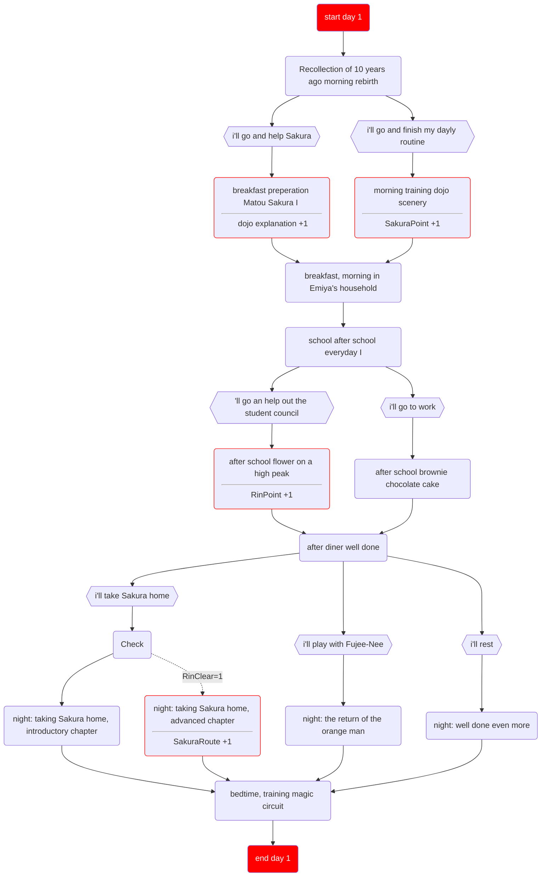

```mermaid
flowchart TD
classDef red stroke:#f00
classDef exp color:#fff,fill:#f00

start1(start day 1):::exp-->a1(Recollection of 10 years ago morning rebirth)
a1-->a2{{i'll go and help Sakura}}
a1-->a3{{i'll go and finish my dayly routine}}
a2-->a4(breakfast preperation Matou Sakura I <hr /> dojo explanation +1):::red
a3-->a5(morning training dojo scenery<hr />SakuraPoint +1):::red
a4-->a6(breakfast, morning in Emiya's household)
a5-->a6
a6-->a7(school after school everyday I)
a7-->a8{{'ll go an help out the student council}}
a7-->a9{{i'll go to work}}
a8-->a10(after school flower on a high peak<hr />RinPoint +1):::red
a9-->a11(after school brownie chocolate cake)
a10-->a12(returning home at night, a white girl)
a11-->a12(after diner well done)
a12-->a13{{i'll take Sakura home}}

a13-->a16(Check)

a16-->a17(night: taking Sakura home, introductory chapter)
a17-->a21

a16-. RinClear=1 .->a20(night: taking Sakura home, advanced chapter<hr />SakuraRoute +1):::red
a20-->a21(bedtime, training magic circuit)

a12-->a14{{i'll play with Fujee-Nee}}
a14-->a18(night: the return of the orange man)
a18-->a21

a12-->a15{{i'll rest}}
a15-->a19(night: well done even more)
a19-->a21

a21-->end1(end day 1):::exp
```