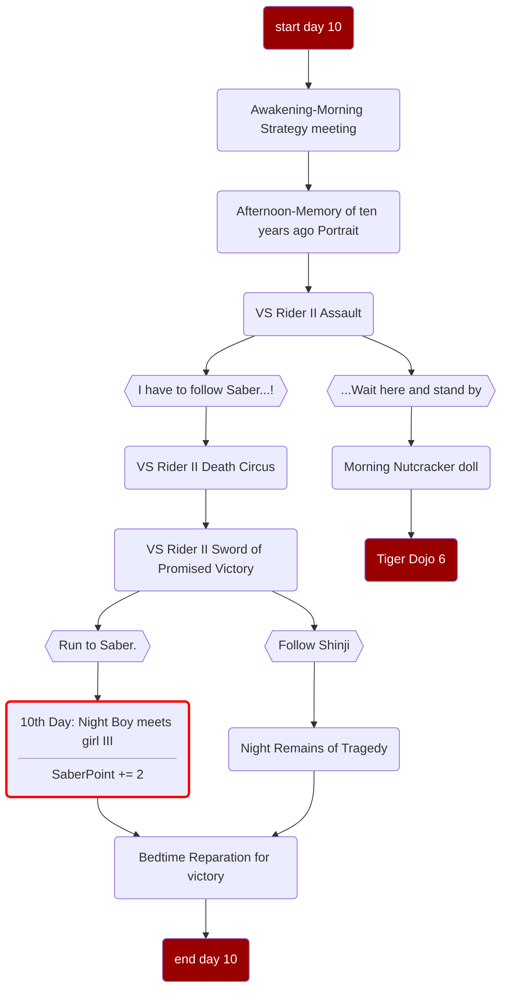

```mermaid
flowchart TD
classDef red stroke:#f00,stroke-width:3
classDef exp color:#fff,fill:#900

start10(start day 10):::exp-->h1(Awakening-Morning Strategy meeting)
h1-->h2(Afternoon-Memory of ten years ago Portrait)
h2-->h3(VS Rider II Assault)
h3-->h4{{I have to follow Saber...!}}
h4-->h5(VS Rider II Death Circus)
h5-->h6(VS Rider II Sword of Promised Victory)
h6-->h7{{Run to Saber.}}
h7-->h8(10th Day: Night Boy meets girl III<hr />SaberPoint += 2):::red
h8-->h9(Bedtime Reparation for victory)
h9-->end10(end day 10):::exp

h6-->h10{{Follow Shinji}}
h10-->h11(Night Remains of Tragedy)
h11-->h9

h3-->h12{{...Wait here and stand by}}
h12-->h13(Morning Nutcracker doll)
h13-->h14(Tiger Dojo 6):::exp
```