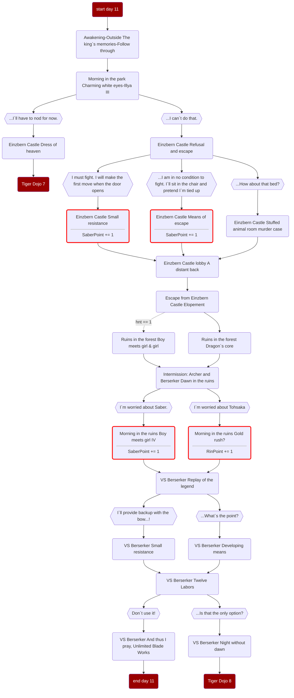

```mermaid
flowchart TD
classDef red stroke:#f00,stroke-width:3
classDef exp color:#fff,fill:#900

start11(start day 11):::exp-->j1(Awakening-Outside The king`s memories-Follow through)
j1-->j2(Morning in the park Charming white eyes-Illya III)
j2-->j3{{...I`ll have to nod for now.}}
j3-->j4(Einzbern Castle Dress of heaven)
j4-->j5(Tiger Dojo 7):::exp

j2-->j6{{...I can`t do that.}}
j6-->j7(Einzbern Castle Refusal and escape)
j7-->j8{{I must fight. I will make the first move when the door opens}}
j8-->j9(Einzbern Castle Small resistance<hr />SaberPoint += 1):::red
j9-->j10(Einzbern Castle lobby A distant back)

j7-->j11{{...I am in no condition to fight. I`ll sit in the chair and pretend I`m tied up}}
j11-->j12(Einzbern Castle Means of escape<hr />SaberPoint += 1):::red
j12-->j10

j7-->j13{{...How about that bed?}}
j13-->j14(Einzbern Castle Stuffed animal room murder case)
j14-->j10

j10-->j15(Escape from Einzbern Castle Elopement)
j15-->j16(Ruins in the forest Dragon`s core)

j15-.hnt == 1.->j17(Ruins in the forest Boy meets girl & girl)
j17-->j18(Intermission: Archer and Berserker Dawn in the ruins)
j16-->j18

j18-->j19{{I`m worried about Saber.}}
j19-->j20(Morning in the ruins Boy meets girl IV<hr />SaberPoint += 1):::red
j20-->j21(VS Berserker Replay of the legend)

j18-->j22{{I`m worried about Tohsaka}}
j22-->j23(Morning in the ruins Gold rush?<hr />RinPoint += 1):::red
j23-->j21

j21-->j24{{I`ll provide backup with the bow...!}}
j24-->j25(VS Berserker Small resistance)
j25-->j26(VS Berserker Twelve Labors)

j21-->j27{{...What`s the point?}}
j27-->j28(VS Berserker Developing means)
j28-->j26

j26-->j29{{Don`t use it!}}
j29-->j30(VS Berserker And thus I pray, Unlimited Blade Works)
j30-->end11(end day 11):::exp

j26-->j31{{...Is that the only option?}}
j31-->j32(VS Berserker Night without dawn)
j32-->j33(Tiger Dojo 8):::exp
```