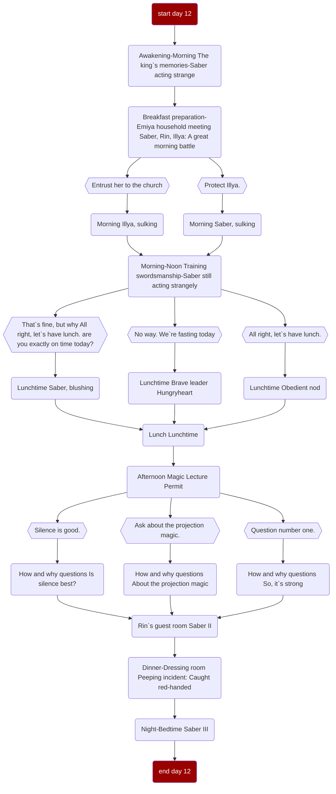

```mermaid
flowchart TD
classDef red stroke:#f00,stroke-width:3
classDef exp color:#fff,fill:#900

start12(start day 12):::exp-->w1(Awakening-Morning The king`s memories-Saber acting strange)
w1-->w2(Breakfast preparation-Emiya household meeting Saber, Rin, Illya: A great morning battle)	
w2-->w3{{Entrust her to the church}}
w3-->w4(Morning Illya, sulking)
w4-->w5(Morning-Noon Training swordsmanship-Saber still acting strangely)


w2-->w6{{Protect Illya.}}
w6-->w7(Morning Saber, sulking)
w7-->w5

w5-->w8{{That`s fine, but why All right, let`s have lunch. are you exactly on time today?}}
w8-->w9(Lunchtime Saber, blushing)
w9-->w10(Lunch Lunchtime)

w5-->w11{{No way. We`re fasting today}}
w11-->w12(Lunchtime Brave leader Hungryheart)
w12-->w10

w5-->w13{{All right, let`s have lunch.}}
w13-->w14(Lunchtime Obedient nod)
w14-->w10

w10-->w15(Afternoon Magic Lecture Permit)
w15-->w16{{Silence is good.}}
w16-->w17(How and why questions Is silence best?)
w17-->w18(Rin`s guest room Saber II)

w15-->w19{{Ask about the projection magic.}}
w19-->w20(How and why questions About the projection magic)
w20-->w18

w15-->w21{{Question number one.}}
w21-->w22(How and why questions So, it`s strong)
w22-->w18

w18-->w23(Dinner-Dressing room Peeping incident: Caught red-handed)
w23-->w24(Night-Bedtime Saber III)
w24-->end12(end day 12):::exp
```