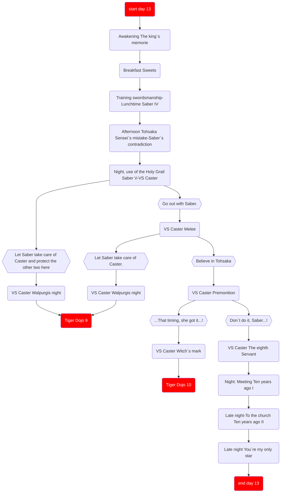

```mermaid
flowchart TD
classDef red stroke:#f00
classDef exp color:#fff,fill:#f00

start13(start day 13):::exp-->x1(Awakening The king`s memorie)
x1-->x2(Breakfast Sweets)
x2-->x3(Training swordsmanship-Lunchtime Saber IV)
x3-->x4(Afternoon Tohsaka Sensei`s mistake-Saber`s contradiction)
x4-->x5(Night, use of the Holy Grail Saber V-VS Caster)

x5-->x6{{Let Saber take care of Caster and protect the other two here}}
x6-->x7(VS Caster Walpurgis night)
x7-->x8(Tiger Dojo 9):::exp

x5-->x9{{Go out with Saber.}}
x9-->x10(VS Caster Melee)
x10-->x11{{Let Saber take care of Caster.}}
x11-->x12(VS Caster Walpurgis night)
x12-->x8

x10-->x13{{Believe in Tohsaka}}
x13-->x14(VS Caster Premonition)
x14-->x15{{...That timing, she got it...!}}
x15-->x16(VS Caster Witch`s mark)
x16-->x17(Tiger Dojo 10):::exp

x14-->x18{{Don`t do it, Saber...!}}
x18-->x19(VS Caster The eighth Servant)
x19-->x20(Night: Meeting Ten years ago I)
x20-->x21(Late night-To the church Ten years ago II)
x21-->x22(Late night You`re my only star)
x22-->end13(end day 13):::exp
```