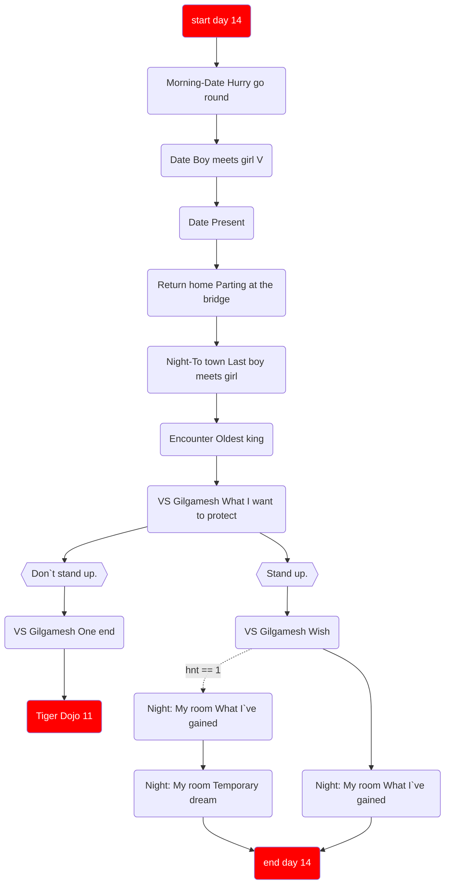

```mermaid
flowchart TD
classDef red stroke:#f00
classDef exp color:#fff,fill:#f00

start14(start day 14):::exp-->c1(Morning-Date Hurry go round)
c1-->c2(Date Boy meets girl V)
c2-->c3(Date Present)
c3-->c4(Return home Parting at the bridge)
c4-->c5(Night-To town Last boy meets girl)
c5-->c6(Encounter Oldest king)
c6-->c7(VS Gilgamesh What I want to protect)

c7-->c8{{Don`t stand up.}}
c8-->c9(VS Gilgamesh One end)
c9-->c10(Tiger Dojo 11):::exp

c7-->c11{{Stand up.}}
c11-->c12(VS Gilgamesh Wish)
c12-.hnt == 1.->c13(Night: My room What I`ve gained)
c13-->c14(Night: My room Temporary dream)
c14-->end14(end day 14):::exp

c12-->c15(Night: My room What I`ve gained)
c15-->end14
```