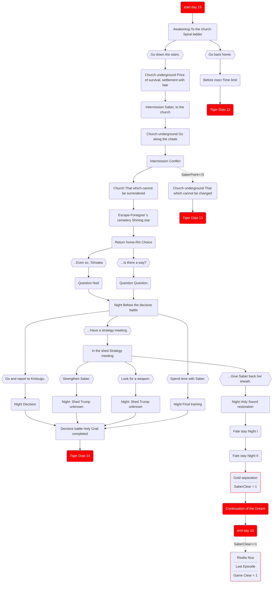

```mermaid
flowchart TD
classDef red stroke:#f00
classDef exp color:#fff,fill:#f00

start15(start day 15):::exp-->c1(Awakening-To the church Spiral ladder)
c1-->c2{{Go down the stairs.}}
c2-->c3(Church underground Price of survival, settlement with fate)
c3-->c4(Intermission Saber, to the church)
c4-->c5(Church underground Go along the cheek)
c5-->c6(Intermission Conflict)
c6-->c7(Church That which cannot be surrendered)
c7-->c13(Escape-Foreigner`s cemetery Shining star)
c13-->c14(Return home-Rin Choice)
c14-->c15{{..Even so, Tohsaka}}
c15-->c16(Question Nod)
c16-->c19(Night Before the decisive battle)

c14-->c17{{...Is there a way?}}
c17-->c18(Question Question)
c18-->c19

c19-->c20{{Go and report to Kiritsugu.}}
c20-->c21(Night Decision)
c21-->c22(Decisive battle Holy Grail completed)
c22-->c23(Tiger Dojo 14):::exp

c19-->c24{{...Have a strategy meeting.}}
c24-->c25(In the shed Strategy meeting)
c25-->c26{{...Give Saber back her sheath.}}
c26-->c27(Night Holy Sword restoration)
c27-->c28(Fate stay Night I)
c28-->c29(Fate stay Night II)
c29-->c30(Gold separation<hr />SaberClear = 1):::red
c30-->dream(Continuation of the Dream):::exp
dream-->end15(end day 15):::exp

c25-->c31{{Strengthen Saber.}}
c31-->c32(Night: Shed Trump unknown)
c32-->c22

c25-->c33{{Look for a weapon.}}
c33-->c34(Night: Shed Trump unknown)
c34-->c22

c19-->c35{{Spend time with Saber.}}
c35-->c36(Night Final training)
c36-->c22

c6-.SaberPoint<=5.->c8(Church underground That which cannot be changed)
c8-->c9(Tiger Dojo 13):::exp

c1-->c10{{Go back home.}}
c10-->c11(Before noon Time limit)
c11-->c12(Tiger Dojo 12):::exp

end15-.SaberClear==1.->xxx(Realta Nua<hr />Last Episode<hr />Game Clear = 1):::red
```