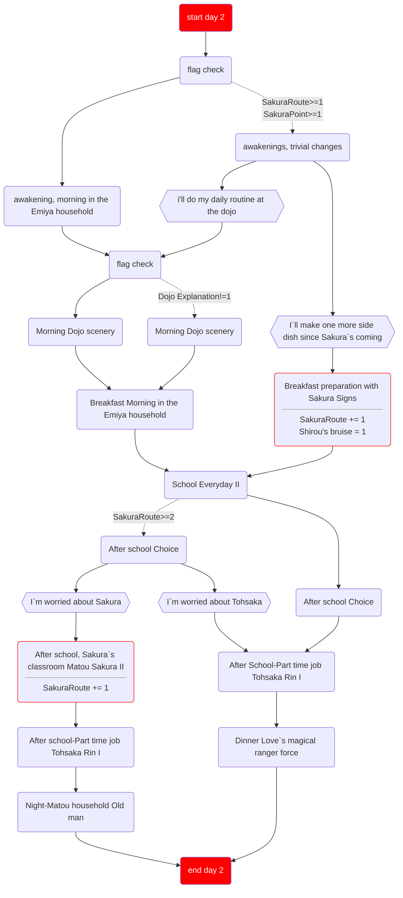

```mermaid
flowchart TD
classDef red stroke:#f00
classDef exp color:#fff,fill:#f00

start2(start day 2):::exp-->z1(flag check)

z1-->z2(awakening, morning in the Emiya household)

z1-.SakuraRoute>=1<br />SakuraPoint>=1.->z3(awakenings, trivial changes)
z3-->z4{{i'll do my daily routine at the dojo}}
z3-->z5{{I`ll make one more side dish since Sakura`s coming}}
z5-->z11(Breakfast preparation with Sakura Signs<hr />SakuraRoute += 1<br />Shirou's bruise = 1):::red
z11-->z10

z4-->z6(flag check)
z2-->z6

z6-->z7(Morning Dojo scenery)
z6-.Dojo Explanation!=1.->z8(Morning Dojo scenery)
z7-->z9(Breakfast Morning in the Emiya household)
z8-->z9
z9-->z10(School Everyday II)

z10-. SakuraRoute>=2 .->z12(After school Choice)
z10-->z13(After school Choice)
z13-->z14(After School-Part time job Tohsaka Rin I)
z14-->z20(Dinner Love`s magical ranger force)

z12-->z15{{I`m worried about Sakura}}
z12-->z16{{I`m worried about Tohsaka}}
z16-->z14
z15-->z17(After school, Sakura`s classroom Matou Sakura II<hr />SakuraRoute += 1):::red
z17-->z18(After school-Part time job Tohsaka Rin I)
z18-->z19(Night-Matou household Old man)

z19-->end2(end day 2):::exp
z20-->end2
```