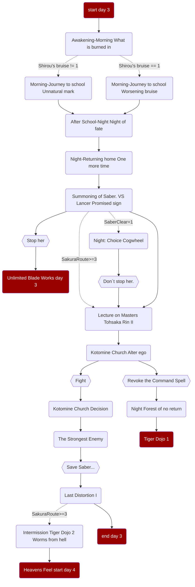

```mermaid
flowchart TD
classDef red stroke:#f00,stroke-width:3
classDef exp color:#fff,fill:#900

start3(start day 3):::exp-->e1(Awakening-Morning What is burned in)
e1-. Shirou's bruise != 1 .->e2(Morning-Journey to school Unnatural mark)
e1-. Shirou's bruise == 1 .->e3(Morning-Journey to school Worsening bruise)
e2-->e4(After School-Night Night of fate)
e3-->e4
e4-->e5(Night-Returning home One more time)
e5-->e6(Summoning of Saber. VS Lancer Promised sign)
e6-.SakuraRoute>=3.->e8(Lecture on Masters Tohsaka Rin II)
e6-.SaberClear=1.->e9(Night: Choice Cogwheel)
e6-->a10{{Stop her}}
a10-->sUBW(Unlimited Blade Works day 3):::exp 
e9-->e11{{Don`t stop her.}}
e11-->e8
e6-->e8
e8-->e12(Kotomine Church Alter ego)
e12-->e13{{Fight}}
e13-->e14(Kotomine Church Decision)
e14-->e15(The Strongest Enemy)

e12-->e16{{Revoke the Command Spell}}
e16-->e17(Night Forest of no return)
e17-->e18(Tiger Dojo 1):::exp

e15-->e19{{Save Saber...}}
e19-->e20(Last Distortion I)
e20-.SakuraRoute>=3.->e21(Intermission Tiger Dojo 2 Worms from hell)
e21-->sHF(Heavens Feel start day 4):::exp
e20-->end3(end day 3):::exp
```