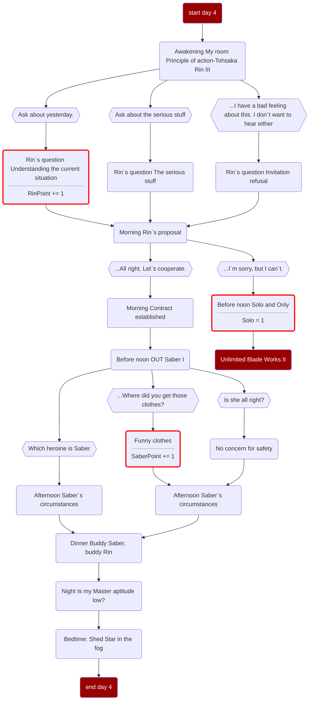

```mermaid
flowchart TD
classDef red stroke:#f00,stroke-width:3
classDef exp color:#fff,fill:#900

start4(start day 4):::exp-->f1(Awakening My room Principle of action-Tohsaka Rin III)
f1-->f2{{Ask about yesterday.}}
f2-->f3(Rin`s question Understanding the current situation<hr />RinPoint += 1):::red
f3-->f4(Morning Rin`s proposal)

f1-->f5{{Ask about the serious stuff}}
f5-->f6(Rin`s question The serious stuff)
f6-->f4

f1-->f7{{...I have a bad feeling about this. I don`t want to hear either}}
f7-->f8(Rin`s question Invitation refusal)
f8-->f4

f4-->f9{{...All right. Let`s cooperate.}}
f9-->f10(Morning Contract established)
f10-->f11(Before noon OUT Saber I)

f4-->f12{{...I`m sorry, but I can`t.}}
f12-->f13(Before noon Solo and Only<hr />Solo = 1):::red
f13-->s2UBW(Unlimited Blade Works II):::exp

f11-->f14{{...Where did you get those clothes?}}
f14-->f15(Funny clothes<hr />SaberPoint += 1):::red
f15-->f16(Afternoon Saber`s circumstances)

f11-->f17{{Is she all right?}}
f17-->f18(No concern for safety)
f18-->f16

f11-->f19{{Which heroine is Saber}}
f19-->f20(Afternoon Saber`s circumstances)
f20-->f21(Dinner Buddy Saber, buddy Rin)

f16-->f21
f21-->f22(Night Is my Master aptitude low?)
f22-->f23(Bedtime: Shed Star in the fog)
f23-->end4(end day 4):::exp
```