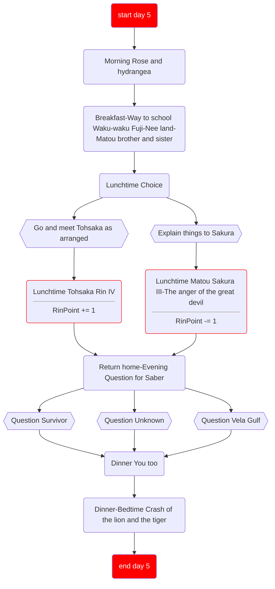

```mermaid
flowchart TD
classDef red stroke:#f00
classDef exp color:#fff,fill:#f00

start5(start day 5):::exp-->q1(Morning Rose and hydrangea)
q1-->q2(Breakfast-Way to school Waku-waku Fuji-Nee land-Matou brother and sister)
q2-->q3(Lunchtime Choice)

q3-->q4{{Go and meet Tohsaka as arranged}}
q4-->q5(Lunchtime Tohsaka Rin IV<hr />RinPoint += 1):::red
q5-->q6(Return home-Evening Question for Saber)

q3-->q7{{Explain things to Sakura}}
q7-->q8(Lunchtime Matou Sakura III-The anger of the great devil<hr />RinPoint -= 1):::red
q8-->q6

q6-->q9{{Question Survivor}}
q9-->q10(Dinner You too)

q6-->q11{{Question Unknown}}
q11-->q10

q6-->q12{{Question Vela Gulf}}
q12-->q10


q10-->q13(Dinner-Bedtime Crash of the lion and the tiger)
q13-->end5(end day 5):::exp
```