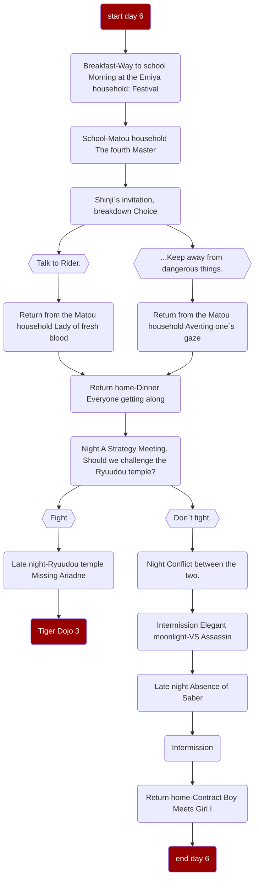

```mermaid
flowchart TD
classDef red stroke:#f00,stroke-width:3
classDef exp color:#fff,fill:#900

start6(start day 6):::exp-->s1(Breakfast-Way to school Morning at the Emiya household: Festival)
s1-->s2(School-Matou household The fourth Master)
s2-->s3(Shinji`s invitation, breakdown Choice)
s3-->s4{{Talk to Rider.}}
s4-->s5(Return from the Matou household Lady of fresh blood)
s5-->s6(Return home-Dinner Everyone getting along)

s3-->s7a{{...Keep away from dangerous things.}}
s7a-->s8(Return from the Matou household Averting one`s gaze)
s8-->s6

s6-->s7b(Night A Strategy Meeting. Should we challenge the Ryuudou temple?)
s7b-->s9{{Fight}}
s9-->s10(Late night-Ryuudou temple Missing Ariadne)
s10-->s11(Tiger Dojo 3):::exp

s7b-->s12{{Don`t fight.}}
s12-->s13(Night Conflict between the two.)
s13-->s14(Intermission Elegant moonlight-VS Assassin)
s14-->s15(Late night Absence of Saber)
s15-->s16(Intermission)
s16-->s17(Return home-Contract Boy Meets Girl I)
s17-->end6(end day 6):::exp
```