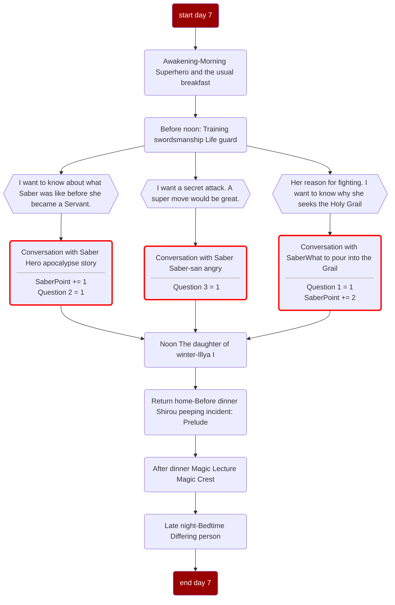

```mermaid
flowchart TD
classDef red stroke:#f00,stroke-width:3
classDef exp color:#fff,fill:#900

start7(start day 7):::exp-->d1(Awakening-Morning Superhero and the usual breakfast)
d1-->d2(Before noon: Training swordsmanship Life guard)

d2-->d3{{I want to know about what Saber was like before she became a Servant.}}
d3-->d4(Conversation with Saber Hero apocalypse story<hr />SaberPoint += 1<br />Question 2 = 1):::red
d4-->d5(Noon The daughter of winter-Illya I)

d2-->d6{{I want a secret attack. A super move would be great.}}
d6-->d7(Conversation with Saber Saber-san angry<hr /> Question 3 = 1):::red
d7-->d5

d2-->d8{{Her reason for fighting. I want to know why she seeks the Holy Grail}}
d8-->d9(Conversation with SaberWhat to pour into the Grail<hr />Question 1 = 1<br />SaberPoint += 2):::red
d9-->d5

d5-->d10(Return home-Before dinner Shirou peeping incident: Prelude)
d10-->d11(After dinner Magic Lecture Magic Crest)
d11-->d12(Late night-Bedtime Differing person)
d12-->end7(end day 7):::exp
```