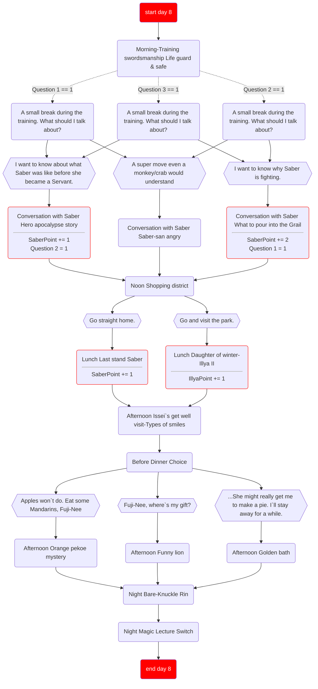

```mermaid
flowchart TD
classDef red stroke:#f00
classDef exp color:#fff,fill:#f00

start8(start day 8):::exp-->f1(Morning-Training swordsmanship Life guard & safe)
f1-.Question 1 == 1.->f2(A small break during the training. What should I talk about?)
f2-->f3{{I want to know about what Saber was like before she became a Servant.}}
f2-->f4{{A super move even a monkey/crab would understand}}
f1-.Question 3 == 1.->f5(A small break during the training. What should I talk about?)
f5-->f3
f5-->f6{{I want to know why Saber is fighting.}}
f1-.Question 2 == 1.->f7(A small break during the training. What should I talk about?)
f7-->f4
f7-->f6

f3-->f8(Conversation with Saber Hero apocalypse story<hr />SaberPoint += 1<br />Question 2 = 1):::red
f8-->f9(Noon Shopping district)

f4-->f10(Conversation with Saber Saber-san angry)
f10-->f9

f6-->f11(Conversation with Saber What to pour into the Grail<hr />SaberPoint += 2<br />Question 1 = 1):::red
f11-->f9

f9-->f12{{Go straight home.}}
f12-->f13(Lunch Last stand Saber<hr />SaberPoint += 1):::red
f13-->f14(Afternoon Issei`s get well visit-Types of smiles)

f9-->f15{{Go and visit the park.}}
f15-->f16(Lunch Daughter of winter-Illya II<hr />IllyaPoint += 1):::red
f16-->f14

f14-->f17(Before Dinner Choice)
f17-->f18{{Apples won`t do. Eat some Mandarins, Fuji-Nee}}
f18-->f19(Afternoon Orange pekoe mystery)
f19-->f20(Night Bare-Knuckle Rin)

f17-->f21{{Fuji-Nee, where`s my gift?}}
f21-->f22(Afternoon Funny lion)
f22-->f20

f17-->f23{{...She might really get me to make a pie. I`ll stay away for a while.}}
f23-->f24(Afternoon Golden bath)
f24-->f20

f20-->f25(Night Magic Lecture Switch)
f25-->end8(end day 8):::exp
```