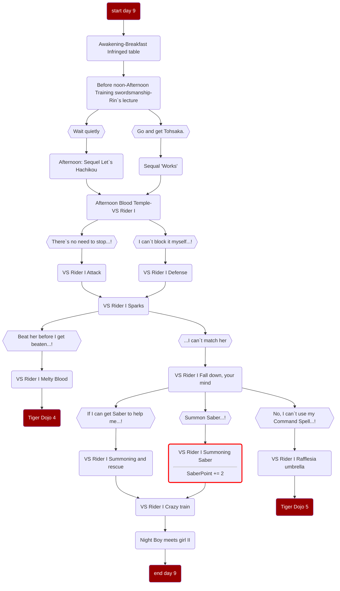

```mermaid
flowchart TD
classDef red stroke:#f00,stroke-width:3
classDef exp color:#fff,fill:#900

start9(start day 9):::exp-->g1(Awakening-Breakfast Infringed table)
g1-->g2(Before noon-Afternoon Training swordsmanship-Rin`s lecture)
g2-->g3{{Wait quietly}}
g3-->g4(Afternoon: Sequel Let`s Hachikou)
g4-->g5(Afternoon Blood Temple-VS Rider I)

g2-->g6{{Go and get Tohsaka.}}
g6-->g7(Sequal 'Works')
g7-->g5

g5-->g8{{There`s no need to stop...!}}
g8-->g9(VS Rider I Attack)
g9-->g10(VS Rider I Sparks)

g5-->g11{{I can`t block it myself...!}}
g11-->g12(VS Rider I Defense)
g12-->g10

g10-->g13{{Beat her before I get beaten...!}}
g13-->g14(VS Rider I Melty Blood)
g14-->g15(Tiger Dojo 4):::exp

g10-->g16{{...I can`t match her}}
g16-->g17(VS Rider I Fall down, your mind)

g17-->g18{{If I can get Saber to help me...!}}
g18-->g19(VS Rider I Summoning and rescue)
g19-->g20(VS Rider I Crazy train)
g20-->g26(Night Boy meets girl II)
g26-->end9(end day 9):::exp

g17-->g21{{Summon Saber...!}}
g21-->g22(VS Rider I Summoning Saber<hr />SaberPoint += 2):::red
g22-->g20

g17-->g23{{No, I can`t use my Command Spell...!}}
g23-->g24(VS Rider I Rafflesia umbrella)
g24-->g25(Tiger Dojo 5):::exp
```