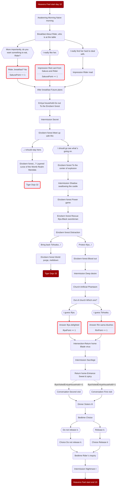

```mermaid
flowchart TD
classDef red stroke:#f00,stroke-width:3
classDef exp color:#fff,fill:#900

starthf10(Heavens Feel start day 10):::exp-->d1(Awakening-Morning Naive morning)
d1-->d2(Breakfast About Rider, who is at the table)

d2-->d3{{More importantly, do you want something to eat, Rider?}}
d3-->d4(Rider, breakfast? No<hr />SakuraPoint += 1):::red
d4-->d9

d2-->d5{{I really like her.}}
d5-->d6(Impression Red card from Sakura and Rider<hr />SakuraPoint += 1):::red
d6-->d9

d2-->d7{{I really find her hard to deal with.}}
d7-->d8(Impression Rider mad)
d8-->d9(After breakfast Future plans)

d9-->d10(Emiya household-Go out To the Einzbern forest)
d10-->d11(Intermission Secret)
d11-->d12(Einzbern forest Meet up with Rin)

d12-->d15{{...I should stay here.}}
d15-->d16(Einzbern forest...? Layered curse of the Womb Realm Mandala)
d16-->d17(Tiger Dojo 32):::red

d12-->d13{{I should go see what`s going on.}}
d13-->d14(Einzbern forest To the center of explosion)
d14-->d18(Intermission Shadow swallowing the castle)
d18-->d19(Einzbern forest Power game)
d19-->d20(Einzbern forest Rescue Illya-Black swordsman)
d20-->d21(Einzbern forest Distraction)

d21-->d23{{Bring back Tohsaka...!}}
d23-->d24(Einzbern forest World purge, meltdown)
d24-->d25(Tiger Dojo 33):::exp

d21-->d26{{Protect Illya...!}}
d26-->d27(Einzbern forest Blood out)
d27-->d28(Intermission Deep desire)
d28-->d29(Church Artificial Phantasm)
d29-->d30(Out of church Which one?)

d30-->d31{{I guess Illya.}}
d31-->d32(Answer Illya delighted<hr />IllyaPoint += 1):::red
d32-->d35

d30-->d33{{I guess Tohsaka.}}
d33-->d34(Answer Rin-sama blushes<hr />RinPoint += 1):::red
d34-->d35(Intersection-Return home Blade virus)

d35-->d36(Intermission Sacrilege)
d36-->d37(Return home-Entrance Sweet & spicy)

d37-.IllyaVisitedEmiyaHousehold==1.->d38{{Conversation Second visit}}
d38-->d39(Dinner Sisters III)

d37-.IllyaVisitedEmiyaHousehold!=1.->d40{{Conversation First visit}}
d40-->d39

d39-->d41(Bedtime Choice)

d41-->d42{{Do not release it.}}
d42-->d43(Choice Do not release it.)
d43-->d44(Bedtime Rider`s inquiry)

d41-->d45{{Release it.}}
d45-->d46(Choice Release it)
d46-->d44

d44-->d47(Intermission Nightmare I)
d47-->endhf10(Heavens Feel start end 10):::exp
```