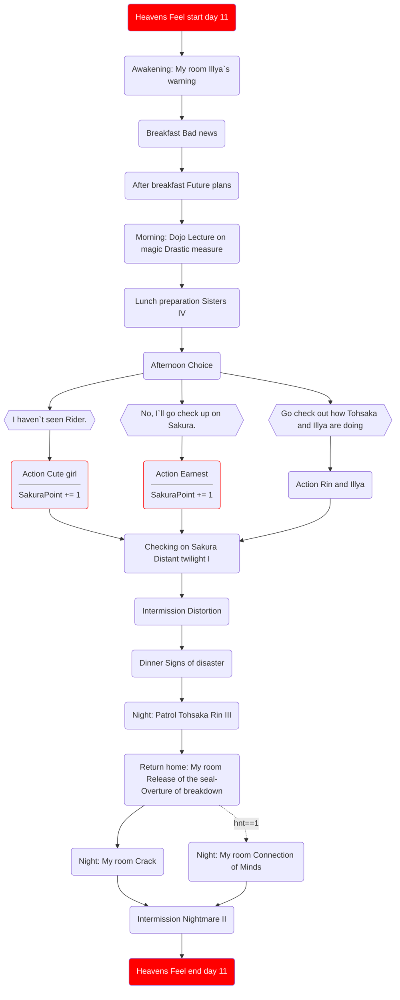

```mermaid
flowchart TD
classDef red stroke:#f00
classDef exp color:#fff,fill:#f00

starthf11(Heavens Feel start day 11):::exp-->f1(Awakening: My room Illya`s warning)
f1-->f2(Breakfast Bad news)
f2-->f3(After breakfast Future plans)
f3-->f4(Morning: Dojo Lecture on magic Drastic measure)
f4-->f5(Lunch preparation Sisters IV)
f5-->f6(Afternoon Choice)

f6-->f7{{I haven`t seen Rider.}}
f7-->f8(Action Cute girl<hr />SakuraPoint += 1):::red
f8-->f9(Checking on Sakura Distant twilight I)

f6-->f10{{No, I`ll go check up on Sakura.}}
f10-->f11(Action Earnest<hr />SakuraPoint += 1):::red
f11-->f9

f6-->f12{{Go check out how Tohsaka and Illya are doing}}
f12-->f13(Action Rin and Illya)
f13-->f9

f9-->f14(Intermission Distortion)
f14-->f15(Dinner Signs of disaster)
f15-->f16(Night: Patrol Tohsaka Rin III)
f16-->f17(Return home: My room Release of the seal-Overture of breakdown)

f17-->f18(Night: My room Crack)
f18-->f19(Intermission Nightmare II)

f17-.hnt==1.->f20(Night: My room Connection of Minds)
f20-->f19

f19-->endhf11(Heavens Feel end day 11):::exp
```