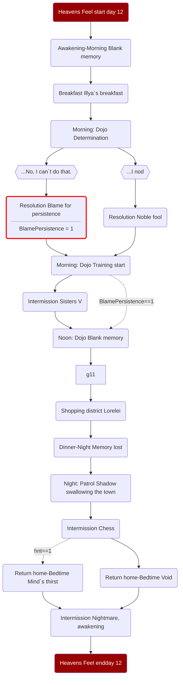

```mermaid
flowchart TD
classDef red stroke:#f00,stroke-width:3
classDef exp color:#fff,fill:#900

starthf12(Heavens Feel start day 12):::exp-->g1(Awakening-Morning Blank memory)
g1-->g2(Breakfast Illya`s breakfast)
g2-->g3(Morning: Dojo Determination)

g3-->g4{{...No, I can`t do that.}}
g4-->g5(Resolution Blame for persistence<hr />BlamePersistence = 1):::red
g5-->g8

g3-->g6{{...I nod}}
g6-->g7(Resolution Noble fool)
g7-->g8(Morning: Dojo Training start)

g8-->g9(Intermission Sisters V)
g9-->g10(Noon: Dojo Blank memory)

g8-.BlamePersistence==1.->g10

g10-->g11

g11-->g12(Shopping district Lorelei)
g12-->g13(Dinner-Night Memory lost)
g13-->g14(Night: Patrol Shadow swallowing the town)
g14-->g15(Intermission Chess)

g15-.hnt==1.->g16(Return home-Bedtime Mind`s thirst)
g16-->g18

g15-->g17(Return home-Bedtime Void)
g17-->g18(Intermission Nightmare, awakening)

g18-->endhf12(Heavens Feel endday 12):::exp
```