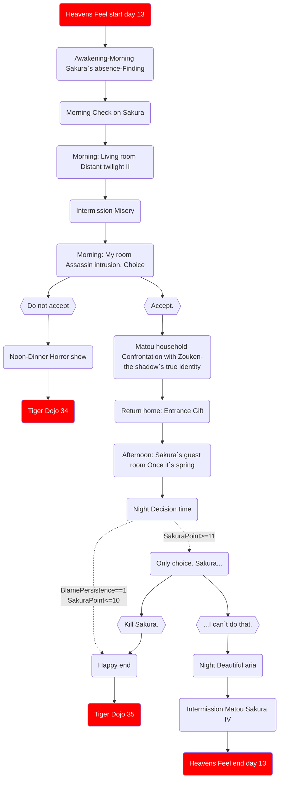

```mermaid
flowchart TD
classDef red stroke:#f00
classDef exp color:#fff,fill:#f00

starthf13(Heavens Feel start day 13):::exp-->h1(Awakening-Morning Sakura`s absence-Finding)
h1-->h2(Morning Check on Sakura)
h2-->h3(Morning: Living room Distant twilight II)
h3-->h4(Intermission Misery)
h4-->h5(Morning: My room Assassin intrusion. Choice)

h5-->h6{{Do not accept}}
h6-->h7(Noon-Dinner Horror show)
h7-->h8(Tiger Dojo 34):::exp

h5-->h9{{Accept.}}
h9-->h10(Matou household Confrontation with Zouken-the shadow`s true identity)
h10-->h11(Return home: Entrance Gift)
h11-->h12(Afternoon: Sakura`s guest room Once it`s spring)
h12-->h13(Night Decision time)

h13-.BlamePersistence==1<br />SakuraPoint<=10.->h14(Happy end)
h14-->h15(Tiger Dojo 35):::exp

h13-.SakuraPoint>=11.->h16(Only choice. Sakura...)

h16-->h18{{Kill Sakura.}}
h18-->h14

h16-->h19{{...I can`t do that.}}
h19-->h20(Night Beautiful aria)
h20-->h21(Intermission Matou Sakura IV)
h21-->endhf13(Heavens Feel end day 13):::exp
```