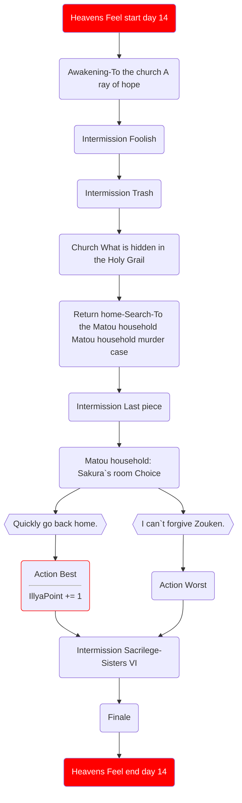

```mermaid
flowchart TD
classDef red stroke:#f00
classDef exp color:#fff,fill:#f00

starthf14(Heavens Feel start day 14):::exp-->w1(Awakening-To the church A ray of hope)
w1-->w2(Intermission Foolish)
w2-->w3(Intermission Trash)
w3-->w4(Church What is hidden in the Holy Grail)
w4-->w5(Return home-Search-To the Matou household Matou household murder case)
w5-->w6(Intermission Last piece)
w6-->w7(Matou household: Sakura`s room Choice)

w7-->w8{{Quickly go back home.}}
w8-->w9(Action Best<hr />IllyaPoint += 1):::red
w9-->w10(Intermission Sacrilege-Sisters VI)

w7-->w11{{I can`t forgive Zouken.}}
w11-->w12(Action Worst)
w12-->w10

w10-->w13(Finale)
w13-->endthf14(Heavens Feel end day 14):::exp
```