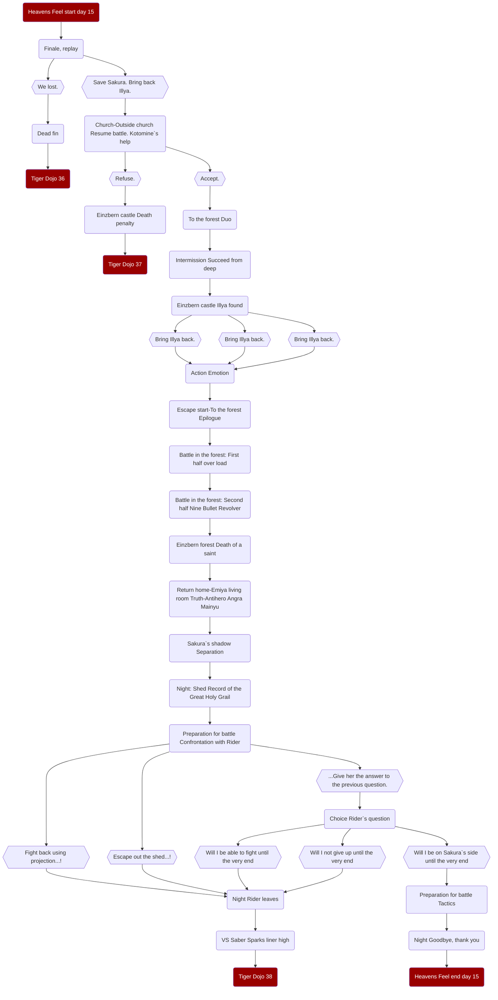

```mermaid
flowchart TD
classDef red stroke:#f00,stroke-width:3
classDef exp color:#fff,fill:#900

starthf15(Heavens Feel start day 15):::exp-->x1(Finale, replay)

x1-->x2{{We lost.}}
x2-->x3(Dead fin)
x3-->x4(Tiger Dojo 36):::exp

x1-->x5{{Save Sakura. Bring back Illya.}}
x5-->x6(Church-Outside church Resume battle. Kotomine`s help)

x6-->x7{{Refuse.}}
x7-->x8(Einzbern castle Death penalty)
x8-->x9(Tiger Dojo 37):::exp

x6-->x10{{Accept.}}
x10-->x11(To the forest Duo)
x11-->x12(Intermission Succeed from deep)
x12-->x13(Einzbern castle Illya found)

x13-->x14{{Bring Illya back.}}
x14-->x17

x13-->x15{{Bring Illya back.}}
x15-->x17

x13-->x16{{Bring Illya back.}}
x16-->x17(Action Emotion)

x17-->x18(Escape start-To the forest Epilogue)
x18-->x19(Battle in the forest: First half over load)
x19-->x20(Battle in the forest: Second half Nine Bullet Revolver)
x20-->x21(Einzbern forest Death of a saint)
x21-->x22(Return home-Emiya living room Truth-Antihero Angra Mainyu)
x22-->x23(Sakura`s shadow Separation)
x23-->x24(Night: Shed Record of the Great Holy Grail)
x24-->x25(Preparation for battle Confrontation with Rider)

x25-->x26{{Fight back using projection...!}}
x26-->x27(Night Rider leaves)
x27-->x28(VS Saber Sparks liner high)
x28-->x29(Tiger Dojo 38):::exp

x25-->x30{{Escape out the shed...!}}
x30-->x27

x25-->x31{{...Give her the answer to the previous question.}}
x31-->x32(Choice Rider`s question)

x32-->x33{{Will I be able to fight until the very end}}
x33-->x27

x32-->x34{{Will I not give up until the very end}}
x34-->x27

x32-->x35{{Will I be on Sakura`s side until the very end}}
x35-->x36(Preparation for battle Tactics)
x36-->x37(Night Goodbye, thank you)
x37-->endhf15(Heavens Feel end day 15):::exp
```