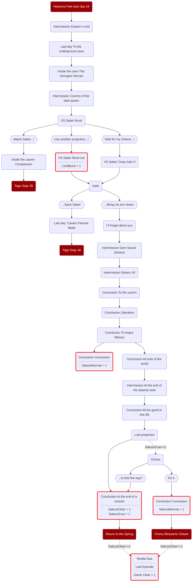

```mermaid
flowchart TD
classDef red stroke:#f00,stroke-width:3
classDef exp color:#fff,fill:#900

starthf16(Heavens Feel start day 16):::exp-->c1(Intermission Zouken`s end)
c1-->c2(Last day To the underground cave)
c2-->c3(Inside the cave The strongest Servan)
c3-->c4(Intermission Country of the dark queen)
c4-->c5(VS Saber Burst)

c5-->c6{{Attack Saber...!}}
c6-->c7(Inside the cavern Compassion)
c7-->c8(Tiger Dojo 39):::exp

c5-->c9{{Use another projection...!}}
c9-->c10(VS Saber Burst out<hr />LimitBurst = 1):::red
c10-->c11(Oath)

c5-->c12{{Wait for my chance...!}}
c12-->c13(VS Saber Crazy train II)
c13-->c11

c11-->c14{{...Save Saber.}}
c14-->c15(Last day: Cavern Femme fatale)
c15-->c16(Tiger Dojo 40):::exp

c11-->c17{{...Bring my arm down.}}
c17-->c18(I`ll forget about you)
c18-->c19(Intermission Gem Sword Zelretch)
c19-->c20(Intermission Sisters VII)
c20-->c21(Conclusion To the cavern)
c21-->c22(Conclusion Liberation)
c22-->c23(Conclusion To Angra Mainyu)
c23-->c24(Conclusion Conclusion<hr />SakuraNormal = 1):::red

c23-->c25(Conclusion All evils of the world)
c25-->c26(Intermission At the end of the dearest wish)
c26-->c27(Conclusion All the good in this life)
c27-->c28(Last projection)
c28-->c31

c28-.SakuraTrue==1.->c29(Choice)
c29-->c30{{...Is that the way?}}
c30-->c31(Conclusion At the end of a miracle<hr />SakuraClear = 1<br />SakuraTrue = 1):::red

c29-->c32{{Do it.}}
c32-->c33(Conclusion Conclusion<hr />SakuraNormal = 1):::red

c31-->c34(Return to the Spring):::exp
c33-->c35(Cherry Blossoms' Dream):::exp

c34-.SakuraClear==1.->xxx(Realta Nua<hr />Last Episode<hr />Game Clear = 1):::red
c35-.SakuraClear==1.->xxx(Realta Nua<hr />Last Episode<hr />Game Clear = 1):::red
```