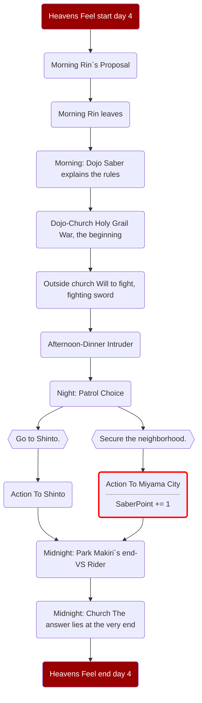

```mermaid
flowchart TD
classDef red stroke:#f00,stroke-width:3
classDef exp color:#fff,fill:#900

starthf4(Heavens Feel start day 4):::exp-->a1(Morning Rin`s Proposal)
a1-->a2(Morning Rin leaves)
a2-->a3(Morning: Dojo Saber explains the rules)
a3-->a4(Dojo-Church Holy Grail War, the beginning)
a4-->a5(Outside church Will to fight, fighting sword)
a5-->a6(Afternoon-Dinner Intruder)
a6-->a7(Night: Patrol Choice)
a7-->a8{{Go to Shinto.}}
a8-->a9(Action To Shinto)
a9-->a10(Midnight: Park Makiri`s end-VS Rider)

a7-->a11{{Secure the neighborhood.}}
a11-->a12(Action To Miyama City<hr />SaberPoint += 1):::red
a12-->a10

a10-->a13(Midnight: Church The answer lies at the very end)
a13-->endhf4(Heavens Feel end day 4):::exp
```