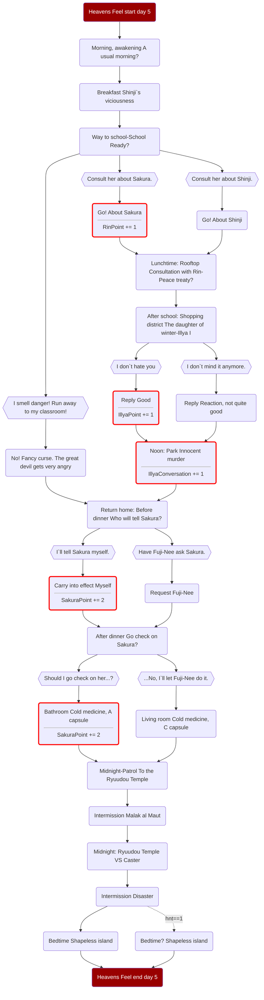

```mermaid
flowchart TD
classDef red stroke:#f00,stroke-width:3
classDef exp color:#fff,fill:#900

starthf5(Heavens Feel start day 5):::exp-->z1(Morning, awakening A usual morning?)
z1-->z2(Breakfast Shinji`s viciousness)
z2-->z3(Way to school-School Ready?)
z3-->z4{{I smell danger! Run away to my classroom!}}
z4-->z5(No! Fancy curse. The great devil gets very angry)
z5-->z6(Return home: Before dinner Who will tell Sakura?)

z3-->z7{{Consult her about Sakura.}}
z7-->z8(Go! About Sakura<hr />RinPoint += 1):::red
z8-->z9(Lunchtime: Rooftop Consultation with Rin-Peace treaty?)

z3-->z10{{Consult her about Shinji.}}
z10-->z11(Go! About Shinji)
z11-->z9

z9-->z12(After school: Shopping district The daughter of winter-Illya I)
z12-->z13{{I don`t hate you}}
z13-->z14(Reply Good<hr />IllyaPoint += 1):::red
z14-->z15(Noon: Park Innocent murder<hr />IllyaConversation += 1):::red
z15-->z6

z12-->z16{{I don`t mind it anymore.}}
z16-->z17(Reply Reaction, not quite good)
z17-->z15

z6-->z18{{I`ll tell Sakura myself.}}
z18-->z19(Carry into effect Myself<hr />SakuraPoint += 2):::red
z19-->z20(After dinner Go check on Sakura?)

z6-->z21{{Have Fuji-Nee ask Sakura.}}
z21-->z22(Request Fuji-Nee)
z22-->z20

z20-->z23{{Should I go check on her...?}}
z23-->z24(Bathroom Cold medicine, A capsule<hr />SakuraPoint += 2):::red
z24-->z25(Midnight-Patrol To the Ryuudou Temple)

z20-->z26{{...No, I`ll let Fuji-Nee do it.}}
z26-->z27(Living room Cold medicine, C capsule)
z27-->z25

z25-->z28(Intermission Malak al Maut)
z28-->z29(Midnight: Ryuudou Temple VS Caster)
z29-->z30(Intermission Disaster)
z30-->z31(Bedtime Shapeless island)
z31-->endhf5(Heavens Feel end day 5):::exp

z30-.hnt==1.->z32(Bedtime? Shapeless island)
z32-->endhf5
```