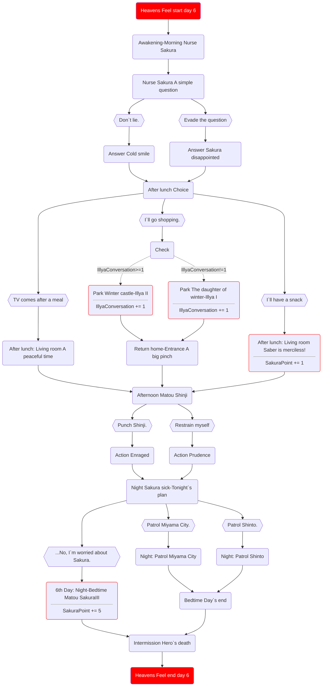

```mermaid
flowchart TD
classDef red stroke:#f00
classDef exp color:#fff,fill:#f00

starthf6(Heavens Feel start day 6):::exp-->e1(Awakening-Morning Nurse Sakura)
e1-->e2(Nurse Sakura A simple question)
e2-->e3{{Don`t lie.}}
e3-->e4(Answer Cold smile)
e4-->e5(After lunch Choice)

e2-->e6{{Evade the question}}
e6-->e7(Answer Sakura disappointed)
e7-->e5

e5-->e8{{TV comes after a meal}}
e8-->e9(After lunch: Living room A peaceful time)
e9-->e10(Afternoon Matou Shinji)

e5-->e11{{I`ll go shopping.}}
e11-->e12(Check)
e12-.IllyaConversation>=1.->e13(Park Winter castle-Illya II<hr />IllyaConversation += 1):::red
e13-->e15(Return home-Entrance A big pinch)

e12-.IllyaConversation!=1.->e14(Park The daughter of winter-Illya I<hr />IllyaConversation += 1):::red
e14-->e15
e15-->e10

e5-->e16{{I`ll have a snack}}
e16-->e17(After lunch: Living room Saber is merciless!<hr />SakuraPoint += 1):::red
e17-->e10

e10-->e18{{Punch Shinji.}}
e18-->e19(Action Enraged)
e19-->e20(Night Sakura sick-Tonight`s plan)

e10-->e21{{Restrain myself}}
e21-->e22(Action Prudence)
e22-->e20

e20-->e23{{Patrol Miyama City.}}
e23-->e24(Night: Patrol Miyama City)
e24-->e25(Bedtime Day`s end)

e20-->e26{{Patrol Shinto.}}
e26-->e27(Night: Patrol Shinto)
e27-->e25

e20-->e28{{...No, I`m worried about Sakura.}}
e28-->e29(6th Day: Night-Bedtime Matou SakuraIII<hr />SakuraPoint += 5):::red
e29-->e30(Intermission Hero`s death)
e25-->e30

e30-->endhf6(Heavens Feel end day 6):::exp
```