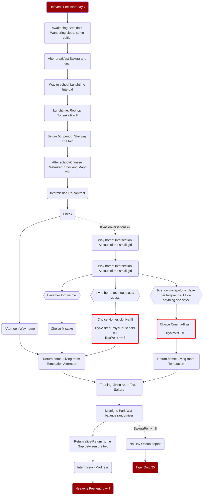

```mermaid
flowchart TD
classDef red stroke:#f00,stroke-width:3
classDef exp color:#fff,fill:#900

starthf7(Heavens Feel start day 7):::exp-->r1(Awakening-Breakfast Wandering cloud, sumo edition)
r1-->r2(After breakfast Sakura and lunch)
r2-->r3(Way to school-Lunchtime Interval)
r3-->r4(Lunchtime: Rooftop Tohsaka Rin II)
r4-->r5(Before 5th period: Stairway The two)
r5-->r6(After school-Chinese Restaurant Shocking Mapo tofu)
r6-->r7(Intermission Re-contract)
r7-->r8(Check)

r8-->r9(Afternoon Way home)
r9-->r14

r8-.IllyaConversation>=2.->r10(Way home: Intersection Assault of the small girl)
r10-->r11(Way home: Intersection Assault of the small girl)
r11-->r12{{Have her forgive me.}}
r12-->r13(Choice Mistake)
r13-->r14(Return home: Living room Temptation Afternoon)

r11-->r15{{Invite her to my house as a guest.}}
r15-->r16(Choice Homesick-Illya III<hr />IllyaVisitedEmiyaHousehold = 1<br />IllyaPoint += 3):::red
r16-->r14

r11-->r17{{To show my apology, Have her forgive me. I`ll do anything she says.}}
r17-->r18(Choice Cinema-Illya III<hr />IllyaPoint += 3):::red
r18-->r19(Return home: Living room Temptation)
r19-->r20(Training-Living room Treat Sakura)

r14-->r20
r20-->r21(Midnight: Park War balance randomizer)

r21-->r22(Return alive-Return home Gap between the two)
r22-->r25(Intermission Madness)
r25-->endhf7(Heavens Feel end day 7):::exp

r21-.SakuraPoint<=8.->r23(7th Day Ocean depths)
r23-->r24(Tiger Dojo 25):::exp
```