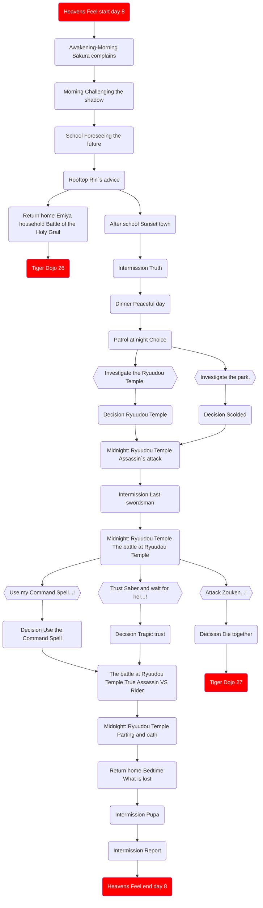

```mermaid
flowchart TD
classDef red stroke:#f00
classDef exp color:#fff,fill:#f00

starthf8(Heavens Feel start day 8):::exp-->q1(Awakening-Morning Sakura complains)
q1-->q2(Morning Challenging the shadow)
q2-->q3(School Foreseeing the future)
q3-->q4(Rooftop Rin`s advice)
q4-->q5(After school Sunset town)

q4-->q6(Return home-Emiya household Battle of the Holy Grail)
q6-->q7(Tiger Dojo 26):::exp

q5-->q8(Intermission Truth)
q8-->q9(Dinner Peaceful day)
q9-->q10(Patrol at night Choice)

q10-->q11{{Investigate the Ryuudou Temple.}}
q11-->q12(Decision Ryuudou Temple)
q12-->q13(Midnight: Ryuudou Temple Assassin`s attack)


q10-->q14{{Investigate the park.}}
q14-->q15(Decision Scolded)
q15-->q13

q13-->q16(Intermission Last swordsman)
q16-->q17(Midnight: Ryuudou Temple The battle at Ryuudou Temple)

q17-->q18{{Use my Command Spell...!}}
q18-->q19(Decision Use the Command Spell)
q19-->q20(The battle at Ryuudou Temple True Assassin VS Rider)

q17-->q21{{Trust Saber and wait for her...!}}
q21-->q22(Decision Tragic trust)
q22-->q20

q17-->q23{{Attack Zouken...!}}
q23-->q24(Decision Die together)
q24-->q25(Tiger Dojo 27):::exp

q20-->q26(Midnight: Ryuudou Temple Parting and oath)
q26-->q27(Return home-Bedtime What is lost)
q27-->q28(Intermission Pupa)
q28-->q29(Intermission Report)

q29-->endhf8(Heavens Feel end day 8):::exp
```