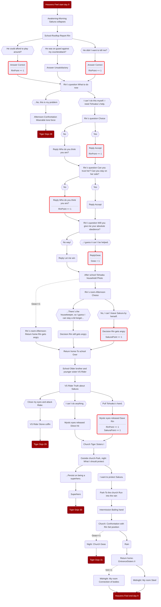

```mermaid
flowchart TD
classDef red stroke:#f00,stroke-width:3
classDef exp color:#fff,fill:#900

starthf9(Heavens Feel start day 9):::exp-->s1(Awakening-Morning Sakura collapses)
s1-->s2(School-Rooftop Report Rin)

s2-->s3{{He could afford to play around?}}
s3-->s4(Answer Correct<hr />RinPoint += 1):::red
s4-->s5(Rin`s question What to do now)

s2-->s6{{He was on guard against my counterattack?}}
s6-->s7(Answer Unsatisfactory)
s7-->s5

s2-->s8{{He didn`t want to kill me?}}
s8-->s9(Answer Correct<hr />RinPoint += 1):::red
s9-->s5

s5-->s10{{...No, this is my problem}}
s10-->s11(Afternoon-Confrontation Miserable lone force)
s11-->s12(Tiger Dojo 28):::exp

s5-->s13{{I can`t do this myself. I need Tohsaka`s help.}}
s13-->s14(Rin`s question Choice)

s14-->s15{{No}}
s15-->s16(Reply Who do you think you are?)
s16-->s17(Rin`s question Can you trust her? Can you stay on her side?)

s14-->s18{{Yes}}
s18-->s19(Reply Accept<hr />RinPoint += 1):::red
s19-->s17

s17-->s20{{No}}
s20-->s21(Reply Who do you think you are?<hr />RinPoint += 1):::red
s21-->s22(Rin`s question Will you give me your absolute obedience?)

s17-->s23{{Yes}}
s23-->s24(Reply Accept)
s24-->s22

s22-->s25{{No way!}}
s25-->s26(Reply Let me win)
s26-->s27(After school-Tohsaka household Photo)

s22-->s28{{...I guess it can`t be helped.}}
s28-->s29(ReplyGeas<hr />Geas = 1):::red
s29-->s27

s27-.Geas==1.->s30(Rin`s room-Afternoon-Return home Rin gets angry)
s30-->s34

s27-->s31(Rin`s room-Afternoon Choice)

s31-->s32{{...There`s the housekeeper, so I guess I can stay a bit longer...}}
s32-->s33(Decision Rin still gets angry)
s33-->s34(Return home-To school Over)

s31-->s35{{No, I can`t leave Sakura by herself.}}
s35-->s36(Decision Rin gets angry<hr />SakuraPoint += 1):::red
s36-->s34

s34-->s37(School Older brother and younger sister-VS Rider)
s37-->s38(VS Rider Truth about Sakura)

s38-->s39{{Close my eyes and attack Rider.}}
s39-->s40(VS Rider Stone coffin)
s40-->s41(Tiger Dojo 29):::exp

s38-->s42{{I can`t do anything.}}
s42-->s43(Mystic eyes released Direct hit)
s43-->s44(Church Tiger Sisters I)
s44-->s45(Outside church-Park, night What I should protect)

s38-->s46{{Pull Tohsaka`s hand.}}
s46-->s47(Mystic eyes released Save Rin<hr />RinPoint += 1<br />SakuraPoint += 1):::red
s47-->s44

s45-->s48(...Persist on being a superhero.)
s48-->s49(Superhero)
s49-->s50(Tiger Dojo 30):::exp

s45-->s51(I want to protect Sakura.)
s51-->s52(Park-To the church Run into the rain)
s52-->s53(Intermission Bailing hand)
s53-->s54(Church: Confrontation with Rin Set position)
s54-.Geas==1.->s55(Night: Church Geas)
s55-->s56(Tiger Dojo 31):::exp

s54-->s57(Rain)
s57-->s58(Return home-EntranceSisters II)
s58-.hnt==1.->s59(Midnight: My room Connection of bodies)
s59-->endhf9(Heavens Feel end day 9):::exp

s58-->s60(Midnight: My room Steel)
s60-->endhf9
```