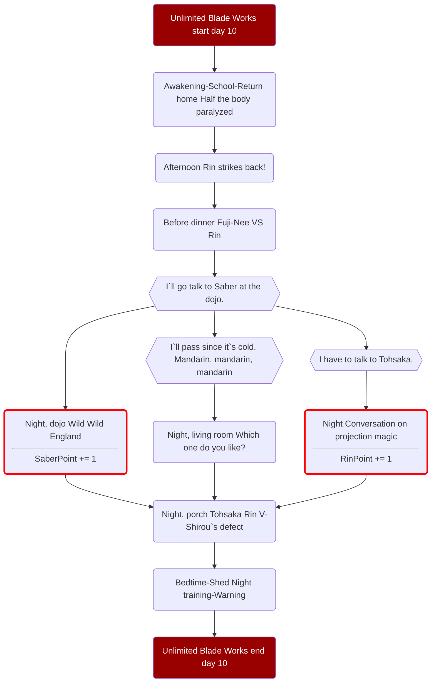

```mermaid
flowchart TD
classDef red stroke:#f00,stroke-width:3
classDef exp color:#fff,fill:#900

startubw10(Unlimited Blade Works start day 10):::exp-->c1(Awakening-School-Return home Half the body paralyzed)
c1-->c2(Afternoon Rin strikes back!)
c2-->c3(Before dinner Fuji-Nee VS Rin)

c3-->c4{{I`ll go talk to Saber at the dojo.}}
c4-->c5(Night, dojo Wild Wild England<hr />SaberPoint += 1):::red
c5-->c6(Night, porch Tohsaka Rin V-Shirou`s defect)

c4-->c7{{I`ll pass since it`s cold. Mandarin, mandarin, mandarin}}
c7-->c8(Night, living room Which one do you like?)
c8-->c6

c4-->c9{{I have to talk to Tohsaka.}}
c9-->c10(Night Conversation on projection magic<hr />RinPoint += 1):::red
c10-->c6

c6-->c11(Bedtime-Shed Night training-Warning)
c11-->endubw10(Unlimited Blade Works end day 10):::exp
```