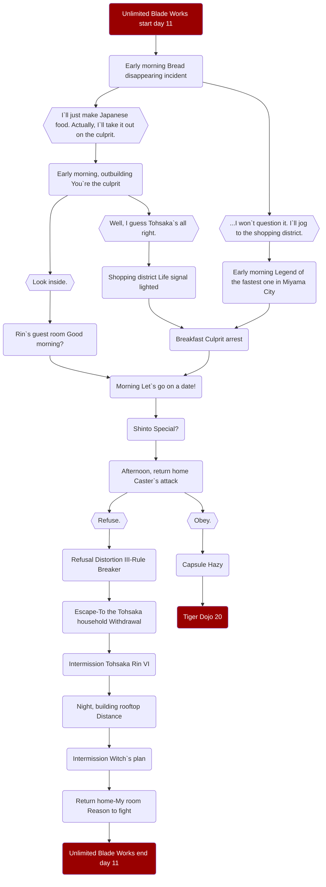

```mermaid
flowchart TD
classDef red stroke:#f00,stroke-width:3
classDef exp color:#fff,fill:#900

startubw11(Unlimited Blade Works start day 11):::exp-->v1(Early morning Bread disappearing incident)

v1-->v2{{I`ll just make Japanese food. Actually, I`ll take it out on the culprit.}}
v2-->v3(Early morning, outbuilding You`re the culprit)

v3-->v4{{Look inside.}}
v4-->v5(Rin`s guest room Good morning?)
v5-->v6(Morning Let`s go on a date!)

v3-->v7{{Well, I guess Tohsaka`s all right.}}
v7-->v8(Shopping district Life signal lighted)
v8-->v9(Breakfast Culprit arrest)
v9-->v6

v1-->v10{{...I won`t question it. I`ll jog to the shopping district.}}
v10-->v11(Early morning Legend of the fastest one in Miyama City)
v11-->v9

v6-->v12(Shinto Special?)
v12-->v13(Afternoon, return home Caster`s attack)

v13-->v14{{Refuse.}}
v14-->v15(Refusal Distortion III-Rule Breaker)
v15-->v16(Escape-To the Tohsaka household Withdrawal)
v16-->v17(Intermission Tohsaka Rin VI)
v17-->v18(Night, building rooftop Distance)
v18-->v19(Intermission Witch`s plan)
v19-->v20(Return home-My room Reason to fight)
v20-->endubw11(Unlimited Blade Works end day 11):::exp

v13-->v21{{Obey.}}
v21-->v22(Capsule Hazy)
v22-->v23(Tiger Dojo 20):::exp
```