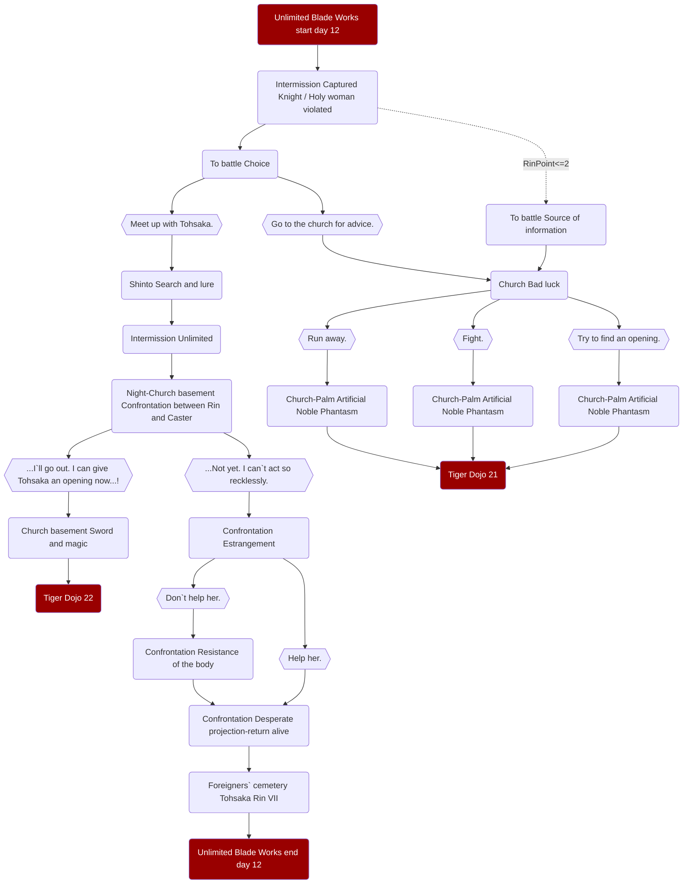

```mermaid
flowchart TD
classDef red stroke:#f00,stroke-width:3
classDef exp color:#fff,fill:#900

startubw12(Unlimited Blade Works start day 12):::exp-->b1(Intermission Captured Knight / Holy woman violated)
b1-->b2(To battle Choice)
b2-->b3{{Meet up with Tohsaka.}}
b3-->b4(Shinto Search and lure)
b4-->b5(Intermission Unlimited)
b5-->b6(Night-Church basement Confrontation between Rin and Caster)

b6-->b7{{...I`ll go out. I can give Tohsaka an opening now...!}}
b7-->b8(Church basement Sword and magic)
b8-->b9(Tiger Dojo 22):::exp

b6-->b10{{...Not yet. I can`t act so recklessly.}}
b10-->b11(Confrontation Estrangement)

b11-->b12{{Don`t help her.}}
b12-->b13(Confrontation Resistance of the body)
b13-->b14(Confrontation Desperate projection-return alive)

b11-->b15{{Help her.}}
b15-->b14

b2-->b16{{Go to the church for advice.}}
b16-->b17(Church Bad luck)

b1-.RinPoint<=2.->b18(To battle Source of information)
b18-->b17

b17-->b19{{Run away.}}
b19-->b20(Church-Palm Artificial Noble Phantasm)
b20-->b21(Tiger Dojo 21):::exp

b17-->b22{{Fight.}}
b22-->b23(Church-Palm Artificial Noble Phantasm)
b23-->b21

b17-->b24{{Try to find an opening.}}
b24-->b25(Church-Palm Artificial Noble Phantasm)
b25-->b21

b14-->b26(Foreigners` cemetery Tohsaka Rin VII)
b26-->endubw12(Unlimited Blade Works end day 12):::exp
```