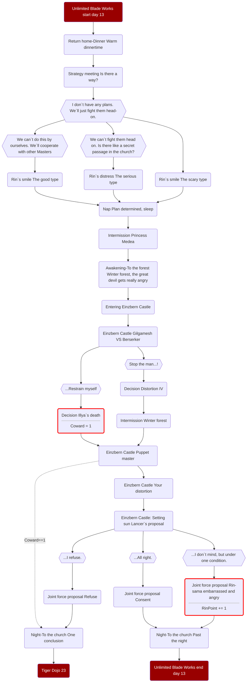

```mermaid
flowchart TD
classDef red stroke:#f00,stroke-width:3
classDef exp color:#fff,fill:#900

startubw13(Unlimited Blade Works start day 13):::exp-->n1(Return home-Dinner Warm dinnertime)
n1-->n2(Strategy meeting Is there a way?)

n2-->n3{{I don`t have any plans. We`ll just fight them head-on.}}
n3-->n4(Rin`s smile The scary type)
n4-->n5(Nap Plan determined, sleep)

n3-->n6{{We can`t fight them head on. Is there like a secret passage in the church?}}
n6-->n7(Rin`s distress The serious type)
n7-->n5

n3-->n8{{We can`t do this by ourselves. We`ll cooperate with other Masters}}
n8-->n9(Rin`s smile The good type)
n9-->n5

n5-->n10(Intermission Princess Medea)
n10-->n11(Awakening-To the forest Winter forest, the great devil gets really angry)
n11-->n12(Entering Einzbern Castle)
n12-->n13(Einzbern Castle Gilgamesh VS Berserker)

n13-->n14{{Stop the man...!}}
n14-->n15(Decision Distortion IV)
n15-->n16(Intermission Winter forest)
n16-->n17(Einzbern Castle Puppet master)

n13-->n18{{...Restrain myself}}
n18-->n19(Decision Illya`s death<hr />Coward = 1):::red
n19-->n17

n17-->n20(Einzbern Castle Your distortion)
n20-->n21(Einzbern Castle: Setting sun Lancer`s proposal)

n21-->n22{{...I refuse.}}
n22-->n23(Joint force proposal Refuse)
n23-->n24(Night-To the church One conclusion)
n24-->n25(Tiger Dojo 23):::exp

n17-.Coward==1.->n24

n21-->n26{{...I don`t mind, but under one condition.}}
n26-->n27(Joint force proposal Rin-sama embarrassed and angry<hr />RinPoint += 1):::red
n27-->n28(Night-To the church Past the night)
n28-->endubw13(Unlimited Blade Works end day 13):::exp

n21-->n29{{...All right.}}
n29-->n30(Joint force proposal Consent)
n30-->n28
```