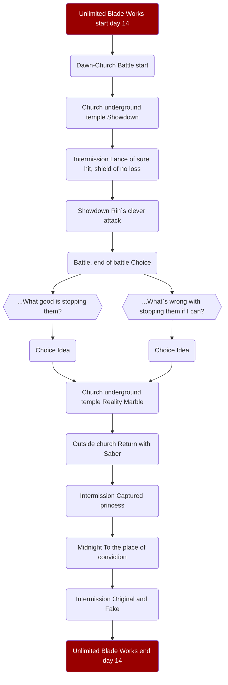

```mermaid
flowchart TD
classDef red stroke:#f00,stroke-width:3
classDef exp color:#fff,fill:#900

startubw14(Unlimited Blade Works start day 14):::exp-->m1(Dawn-Church Battle start)
m1-->m2(Church underground temple Showdown)
m2-->m3(Intermission Lance of sure hit, shield of no loss)
m3-->m4(Showdown Rin`s clever attack)
m4-->m5(Battle, end of battle Choice)

m5-->m6{{...What good is stopping them?}}
m6-->m7(Choice Idea)
m7-->m8(Church underground temple Reality Marble)

m5-->m9{{...What`s wrong with stopping them if I can?}}
m9-->m10(Choice Idea)
m10-->m8

m8-->m11(Outside church Return with Saber)
m11-->m12(Intermission Captured princess)
m12-->m13(Midnight To the place of conviction)
m13-->m14(Intermission Original and Fake)
m14-->endubw14(Unlimited Blade Works end day 14):::exp
```