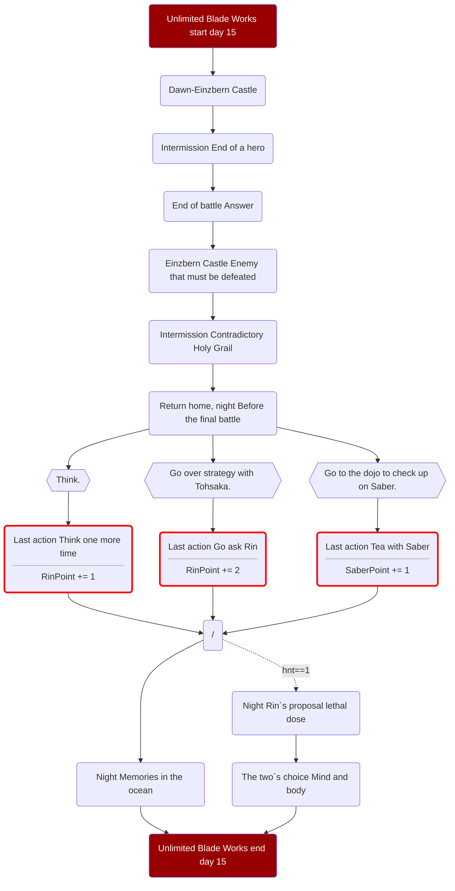

```mermaid
flowchart TD
classDef red stroke:#f00,stroke-width:3
classDef exp color:#fff,fill:#900

startubw15(Unlimited Blade Works start day 15):::exp-->l1(Dawn-Einzbern Castle)
l1-->l2(Intermission End of a hero)
l2-->l3(End of battle Answer)
l3-->l4(Einzbern Castle Enemy that must be defeated)
l4-->l5(Intermission Contradictory Holy Grail)
l5-->l6(Return home, night Before the final battle)

l6-->l7{{Think.}}
l7-->l8(Last action Think one more time<hr />RinPoint += 1):::red
l8-->l9(/)

l6-->l10{{Go over strategy with Tohsaka.}}
l10-->l11(Last action Go ask Rin<hr />RinPoint += 2):::red
l11-->l9

l6-->l12{{Go to the dojo to check up on Saber.}}
l12-->l13(Last action Tea with Saber<hr />SaberPoint += 1):::red
l13-->l9

l9-->l14(Night Memories in the ocean)
l14-->endubw15(Unlimited Blade Works end day 15):::exp

l9-.hnt==1.->l15(Night Rin`s proposal lethal dose)
l15-->l16(The two`s choice Mind and body)
l16-->endubw15
```