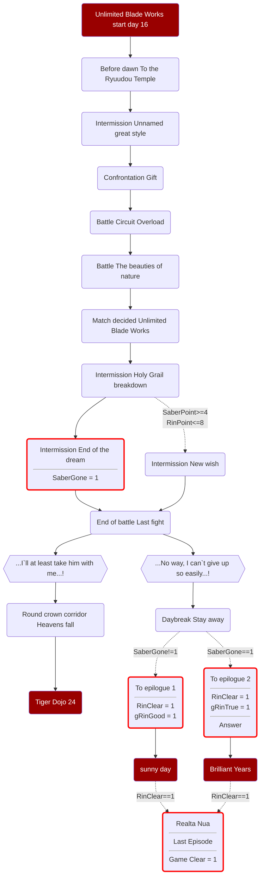

```mermaid
flowchart TD
classDef red stroke:#f00,stroke-width:3
classDef exp color:#fff,fill:#900

startubw16(Unlimited Blade Works start day 16):::exp-->j1(Before dawn To the Ryuudou Temple)
j1-->j2(Intermission Unnamed great style)
j2-->j3(Confrontation Gift)
j3-->j4(Battle Circuit Overload)
j4-->j5(Battle The beauties of nature)
j5-->j6(Match decided Unlimited Blade Works)
j6-->j7(Intermission Holy Grail breakdown)
j7-->j8(Intermission End of the dream<hr />SaberGone = 1):::red
j8-->j9(End of battle Last fight)

j7-.SaberPoint>=4<br />RinPoint<=8.->j10(Intermission New wish)
j10-->j9

j9-->j11{{...I`ll at least take him with me...!}}
j11-->j12(Round crown corridor Heavens fall)
j12-->j13(Tiger Dojo 24):::exp

j9-->j14{{...No way, I can`t give up so easily...!}}
j14-->j15(Daybreak Stay away)

j15-.SaberGone!=1.->j16(To epilogue 1<hr />RinClear = 1<br />gRinGood = 1):::red
j16-->j17(sunny day):::exp

j15-.SaberGone==1.->j18(To epilogue 2<hr />RinClear = 1<br />gRinTrue = 1<hr />Answer):::red
j18-->j19(Brilliant Years):::exp

j17-.RinClear==1.->xxx(Realta Nua<hr />Last Episode<hr />Game Clear = 1):::red
j19-.RinClear==1.->xxx
```