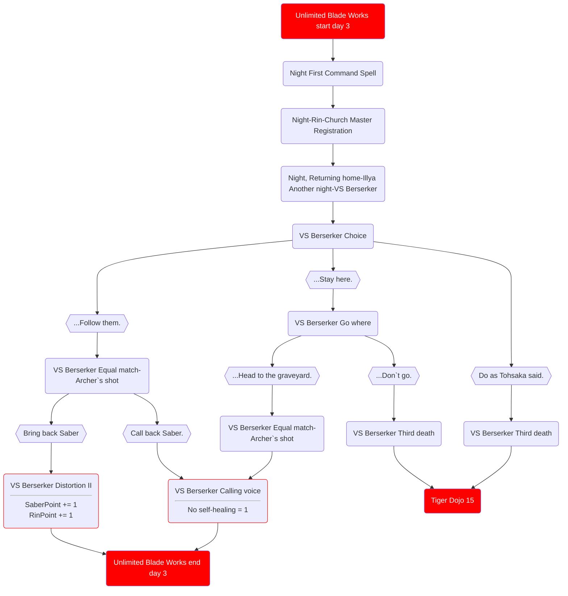

```mermaid
flowchart TD
classDef red stroke:#f00
classDef exp color:#fff,fill:#f00

startubw3(Unlimited Blade Works start day 3):::exp-->a1(Night First Command Spell)
a1-->a2(Night-Rin-Church Master Registration)
a2-->a3(Night, Returning home-Illya Another night-VS Berserker)
a3-->a4(VS Berserker Choice)

a4-->a5{{...Follow them.}}
a5-->a6(VS Berserker Equal match-Archer`s shot)
a6-->a7{{Bring back Saber}}
a7-->a8(VS Berserker Distortion II<hr />SaberPoint += 1<br />RinPoint += 1):::red
a8-->endubw3(Unlimited Blade Works end day 3):::exp

a6-->a9{{Call back Saber.}}
a9-->a10(VS Berserker Calling voice<hr />No self-healing = 1):::red
a10-->endubw3

a4-->a11{{...Stay here.}}
a11-->a12(VS Berserker Go where)
a12-->a13{{...Head to the graveyard.}}
a13-->a14(VS Berserker Equal match-Archer`s shot)
a14-->a10

a12-->a15{{...Don`t go.}}
a15-->a16(VS Berserker Third death)
a16-->a17(Tiger Dojo 15):::exp

a4-->a18{{Do as Tohsaka said.}}
a18-->a19(VS Berserker Third death)
a19-->a17
```