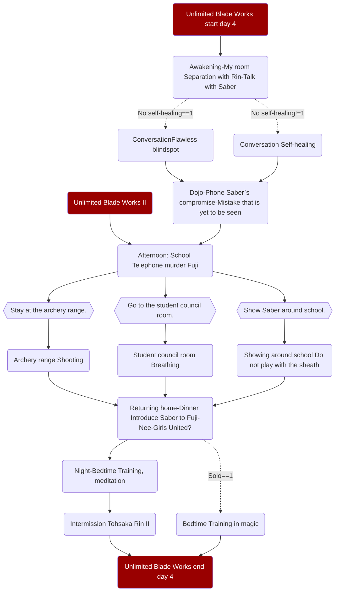

```mermaid
flowchart TD
classDef red stroke:#f00,stroke-width:3
classDef exp color:#fff,fill:#900

startubw4(Unlimited Blade Works start day 4):::exp-->z1(Awakening-My room Separation with Rin-Talk with Saber)
z1-.No self-healing==1.->z2(ConversationFlawless blindspot)
z2-->z3(Dojo-Phone Saber`s compromise-Mistake that is yet to be seen)

z1-.No self-healing!=1.->z4(Conversation Self-healing)
z4-->z3

s2UBW(Unlimited Blade Works II):::exp-->z5
z3-->z5(Afternoon: School Telephone murder Fuji)

z5-->z6{{Stay at the archery range.}}
z6-->z7(Archery range Shooting)
z7-->z8(Returning home-Dinner Introduce Saber to Fuji-Nee-Girls United?)

z5-->z9{{Go to the student council room.}}
z9-->z10(Student council room Breathing)
z10-->z8

z5-->z11{{Show Saber around school.}}
z11-->z12(Showing around school Do not play with the sheath)
z12-->z8

z8-->z13(Night-Bedtime Training, meditation)
z13-->z14(Intermission Tohsaka Rin II)
z14-->endubw4(Unlimited Blade Works end day 4):::exp

z8-.Solo==1.->z15(Bedtime Training in magic)
z15-->endubw4
```