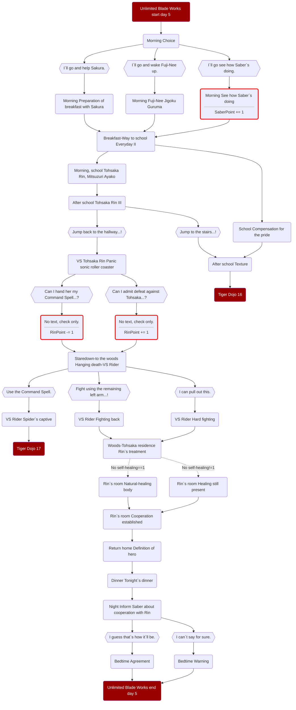

```mermaid
flowchart TD
classDef red stroke:#f00,stroke-width:3
classDef exp color:#fff,fill:#900

startubw5(Unlimited Blade Works start day 5):::exp-->e1(Morning Choice)

e1-->e2{{I`ll go and help Sakura.}}
e2-->e3(Morning Preparation of breakfast with Sakura)
e3-->e4(Breakfast-Way to school Everyday II)

e1-->e5{{I`ll go and wake Fuji-Nee up.}}
e5-->e6(Morning Fuji-Nee Jigoku Guruma)
e6-->e4

e1-->e7{{I`ll go see how Saber`s doing.}}
e7-->e8(Morning See how Saber`s doing<hr />SaberPoint += 1):::red
e8-->e4

e4-->e9(Morning, school Tohsaka Rin, Mitsuzuri Ayako)
e9-->e10(After school Tohsaka Rin III)

e10-->e11{{Jump back to the hallway...!}}
e11-->e12(VS Tohsaka Rin Panic sonic roller coaster)

e12-->e13{{Can I hand her my Command Spell...?}}
e13-->e14(No text, check only.<hr />RinPoint -= 1):::red
e14-->e15(Staredown-to the woods Hanging death-VS Rider)

e12-->e16{{Can I admit defeat against Tohsaka...?}}
e16-->e17(No text, check only.<hr />RinPoint += 1):::red
e17-->e15

e10-->e18{{Jump to the stairs...!}}
e18-->e19(After school Texture)
e19-->e20(Tiger Dojo 16):::exp

e4-->e21(School Compensation for the pride)
e21-->e19

e15-->e22{{Use the Command Spell.}}
e22-->e23(VS Rider Spider`s captive)
e23-->e24(Tiger Dojo 17):::exp

e15-->e25{{Fight using the remaining left arm...!}}
e25-->e26(VS Rider Fighting back)
e26-->e27(Woods-Tohsaka residence Rin`s treatment)

e15-->e28{{I can pull out this.}}
e28-->e29(VS Rider Hard fighting)
e29-->e27

e27-.No self-healing==1.->e30(Rin`s room Natural-healing body)
e30-->e31(Rin`s room Cooperation established)

e27-.No self-healing!=1.->e32(Rin`s room Healing still present)
e32-->e31

e31-->e33(Return home Definition of hero)
e33-->e34(Dinner Tonight`s dinner)
e34-->e35(Night Inform Saber about cooperation with Rin)

e35-->e36{{I guess that`s how it`ll be.}}
e36-->e37(Bedtime Agreement)
e37-->endubw5(Unlimited Blade Works end day 5):::exp

e35-->e38{{I can`t say for sure.}}
e38-->e39(Bedtime Warning)
e39-->endubw5
```