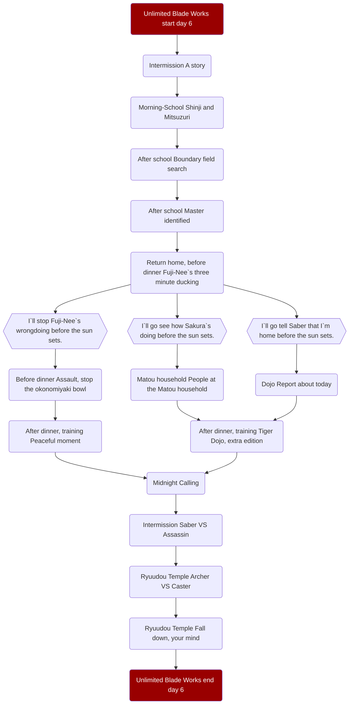

```mermaid
flowchart TD
classDef red stroke:#f00,stroke-width:3
classDef exp color:#fff,fill:#900

startubw6(Unlimited Blade Works start day 6):::exp-->f1(Intermission A story)
f1-->f2(Morning-School Shinji and Mitsuzuri)
f2-->f3(After school Boundary field search)
f3-->f4(After school Master identified)
f4-->f5(Return home, before dinner Fuji-Nee`s three minute ducking)

f5-->f6{{I`ll stop Fuji-Nee`s wrongdoing before the sun sets.}}
f6-->f7(Before dinner Assault, stop the okonomiyaki bowl)
f7-->f8(After dinner, training Peaceful moment)
f8-->f9(Midnight Calling)

f5-->f10{{I`ll go see how Sakura`s doing before the sun sets.}}
f10-->f11(Matou household People at the Matou household)
f11-->f12(After dinner, training Tiger Dojo, extra edition)
f12-->f9

f5-->f13{{I`ll go tell Saber that I`m home before the sun sets.}}
f13-->f14(Dojo Report about today)
f14-->f12

f9-->f15(Intermission Saber VS Assassin)
f15-->f16(Ryuudou Temple Archer VS Caster)
f16-->f17(Ryuudou Temple Fall down, your mind)
f17-->endubw6(Unlimited Blade Works end day 6):::exp
```