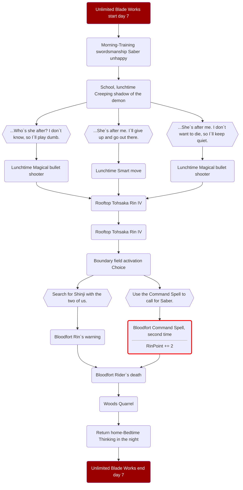

```mermaid
flowchart TD
classDef red stroke:#f00,stroke-width:3
classDef exp color:#fff,fill:#900

startubw7(Unlimited Blade Works start day 7):::exp-->g1(Morning-Training swordsmanship Saber unhappy)
g1-->g2(School, lunchtime Creeping shadow of the demon)

g2-->g3{{...Who`s she after? I don`t know, so I`ll play dumb.}}
g3-->g4(Lunchtime Magical bullet shooter)
g4-->g5(Rooftop Tohsaka Rin IV)

g2-->g6{{...She`s after me. I`ll give up and go out there.}}
g6-->g7(Lunchtime Smart move)
g7-->g5

g2-->g8{{...She`s after me. I don`t want to die, so I`ll keep quiet.}}
g8-->g9(Lunchtime Magical bullet shooter)
g9-->g5

g5-->g10(Rooftop Tohsaka Rin IV)
g10-->g11(Boundary field activation Choice)

g11-->g12{{Search for Shinji with the two of us.}}
g12-->g13(Bloodfort Rin`s warning)
g13-->g14(Bloodfort Rider`s death)

g11-->g15{{Use the Command Spell to call for Saber.}}
g15-->g16(Bloodfort Command Spell, second time<hr />RinPoint += 2):::red
g16-->g14

g14-->g17(Woods Quarrel)
g17-->g18(Return home-Bedtime Thinking in the night)
g18-->endubw7(Unlimited Blade Works end day 7):::exp
```