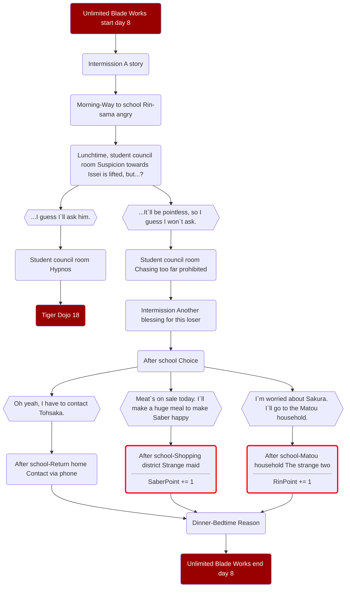

```mermaid
flowchart TD
classDef red stroke:#f00,stroke-width:3
classDef exp color:#fff,fill:#900

startubw8(Unlimited Blade Works start day 8):::exp-->w1(Intermission A story)
w1-->w2(Morning-Way to school Rin-sama angry)
w2-->w3(Lunchtime, student council room Suspicion towards Issei is lifted, but...?)

w3-->w4{{...I guess I`ll ask him.}}
w4-->w5(Student council room Hypnos)
w5-->w6(Tiger Dojo 18):::exp

w3-->w7{{...It`ll be pointless, so I guess I won`t ask.}}
w7-->w8(Student council room Chasing too far prohibited)
w8-->w9(Intermission Another blessing for this loser)
w9-->w10(After school Choice)

w10-->w11{{Oh yeah, I have to contact Tohsaka.}}
w11-->w12(After school-Return home Contact via phone)
w12-->w13(Dinner-Bedtime Reason)

w10-->w14{{Meat`s on sale today. I`ll make a huge meal to make Saber happy}}
w14-->w15(After school-Shopping district Strange maid<hr />SaberPoint += 1):::red
w15-->w13

w10-->w16{{I`m worried about Sakura. I`ll go to the Matou household.}}
w16-->w17(After school-Matou household The strange two<hr />RinPoint += 1):::red
w17-->w13

w13-->endubw8(Unlimited Blade Works end day 8):::exp
```