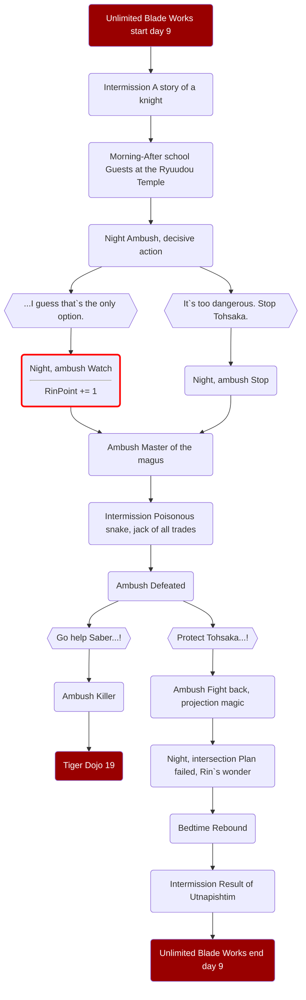

```mermaid
flowchart TD
classDef red stroke:#f00,stroke-width:3
classDef exp color:#fff,fill:#900

startubw9(Unlimited Blade Works start day 9):::exp-->x1(Intermission A story of a knight)
x1-->x2(Morning-After school Guests at the Ryuudou Temple)
x2-->x3(Night Ambush, decisive action)

x3-->x4{{...I guess that`s the only option.}}
x4-->x5(Night, ambush Watch<hr />RinPoint += 1):::red
x5-->x6(Ambush Master of the magus)

x3-->x7{{It`s too dangerous. Stop Tohsaka.}}
x7-->x8(Night, ambush Stop)
x8-->x6

x6-->x9(Intermission Poisonous snake, jack of all trades)
x9-->x10(Ambush Defeated)

x10-->x11{{Go help Saber...!}}
x11-->x12(Ambush Killer)
x12-->x13(Tiger Dojo 19):::exp

x10-->x14{{Protect Tohsaka...!}}
x14-->x15(Ambush Fight back, projection magic)
x15-->x16(Night, intersection Plan failed, Rin`s wonder)
x16-->x17(Bedtime Rebound)
x17-->x18(Intermission Result of Utnapishtim)
x18-->endubw9(Unlimited Blade Works end day 9):::exp
```